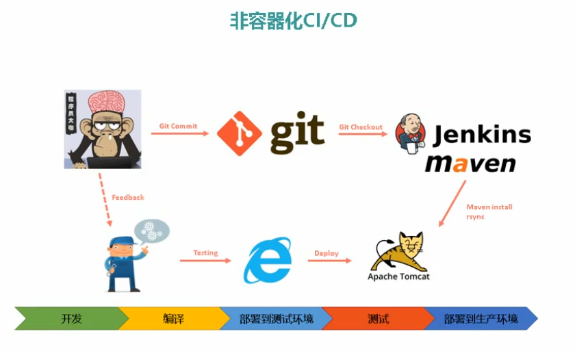

# Jenkins 基础

## 1. 持续集成

- 持续集成（ci）代码合并、构建、部署、测试在一起，不断执行这个过程对结果进行反馈
- 持续部署（cd）部署到生产环境
- 持续交付（cd）部署到生产环境，给用户使用
- DevOps 是一个完整的面向 IT 运维的工作流，以 IT 自动化以及持续集成（ci）、持续部署（cd）为基础，来优化程序开发、测试、系统运维等所有环节
  http://img.zhufengpeixun.cn/cicd.jpg

## 2. Jenkins




## 3. Git 安装

### 3.1 git 服务器

#### 3.1.1 安装 git

```bash
yum isntall -y git
```

#### 3.1.2 创建 git 用户

```bash
useradd git
passwd git
```

#### 3.1.3 创建仓库

```bash
su - git
mkdir -p ~/repos/app.git
cd ~/repos/app.git
git --bare init
```

### 3.2 git 客户端（web 服务器）

#### 3.2.1 安装 git

```bash
yum install -y git
```

```bash
cd /usr/local/src
git clone git@[你的ip]:/home/git/repos/app.git
cd app
git config --global user.email 'zhoubichuan@icloud.com'
git config --global user.name 'zhoubichuan'
touch index.html
git add -A
git commit -m 'init'
git push origin master
```

#### 免密码登陆

**生成密钥**

- 先登陆 web 服务器生成密钥并拷贝公钥

```bash
ssh-keygen -t rsa
cat ~/.ssh/id_rsa.pub
```

**拷贝公钥**

- 再登录 git 服务器
- 要注意如果你要免登录 git 用户，就需要把自己的公钥拷贝到 git 用户的 authorized_keys 文件里

```bash
ssh-keygen -t rsa
chmod 700 /home/git/.ssh
vi /home/git/.ssh/authorized_keys
chmod 600 /home/git/.ssh/authorized_keys
```

**允许公钥登录**

- 再登录 git 服务器
- vim /etc/ssh/sshd_config

```bash
PubkeyAuthentication yes
systemctl restart sshd
```

## 4. Jenkins

- jdk
- jenkins 官网

### 4.1 安装 JDK

- jdk

```bash
cd /usr/local/src
wget http://img.zhufengpeixun.cn/jdk1.8.0_211.tar.gz
tar -xzvf jdk1.8.0_211.tar.gz
cp -r /usr/local/src/jdk1.8.0_211 /usr/java
rm -rf /usr/bin/java　&&　ln -s /usr/java/jdk1.8.0_211/bin/java /usr/bin/java
```

### 4.2 修改配置文件

vi /etc/profile

```bash
JAVA_HOME=/usr/java/jdk1.8.0_211
export CLASSPATH=.:${JAVA_HOME}/jre/lib/rt.jar:${JAVA_HOME}/lib/dt.jar:${JAVA_HOME}/lib/tools.jar
export PATH=$PATH:${JAVA_HOME}/bin
```

### 4.3 生效配置

```bash
source /etc/profile
java --version
```

### 4.4 安装 jenkins

```bash
wget -O /etc/yum.repos.d/jenkins.repo https://pkg.jenkins.io/redhat-stable/jenkins.repo
rpm --import https://pkg.jenkins.io/redhat-stable/jenkins.io.key
yum install -y jenkins
```

### 4.5 关闭防火墙

```bash
systemctl stop firewalld.service
systemctl disable firewalld.service
```

```bash
javap -v JNLPMain.class
J2SE 8 = 52
J2SE 7 = 51
J2SE 6.0 = 50
J2SE 5.0 = 49
JDK 1.4 = 48
JDK 1.3 = 47
JDK 1.2 = 46
JDK 1.1 = 45
```

### 4.6 启动 jenkins

```bash
systemctl start jenkins
systemctl daemon-reload
systemctl status jenkins
```

### 4.7 选择 java 版本

vi /etc/init.d/jenkins

```bash
candidates="
#/etc/alternatives/java
#/usr/lib/jvm/java-1.8.0/bin/java
#/usr/lib/jvm/jre-1.8.0/bin/java
#/usr/lib/jvm/java-1.7.0/bin/java
#/usr/lib/jvm/jre-1.7.0/bin/java
/usr/bin/java
"
```

### 4.8 运行用户

一定要改一下 root 用户，不然流水线 SCM 拉不到脚本 vi /etc/sysconfig/jenkins

```bash
JENKINS_USER="root"
```

### 4.8 访问 jenkins

http://192.168.20.133:8080

### 4.9 安装 maven

```bash
yum install maven -y

# rpm -ql maven

/etc/m2.conf
/etc/maven
/etc/maven/settings.xml
/usr/bin/mvn
/usr/share/maven/conf/settings.xml
```

### 4.10 使用 jenkins

- jenkins
- OWASP(Open Web Application Security Project),开放式 Web 应用程序安全项目,它识别项目依赖关系，并检查是否存在任何已知的和公开的漏洞.
- PAM（Pluggable Authentication Modules ）是由 Sun 提出的一种认证机制。它通过提供一些动态链接库和一套统一的 API，将系统提供的服务和该服务的认证方式分开，使得系统管理员可以灵活地根据需要给不同的服务配置不同的认证方式而无需更改服务程序，同时也便于向系统中添加新的认证手段。 PAM 模块是一种嵌入式模块，修改后即时生效。
- LDAP（Light Directory Access Portocol）,它是基于 X.500 标准的轻量级目录访问协议

| 插件名称                           | 插件作用                                                                                                                        |
| ---------------------------------- | ------------------------------------------------------------------------------------------------------------------------------- |
| Folders                            | (https://plugins.jenkins.io/cloudbees-folder),这个插件支持用户使用目录管理项目，目录支持嵌套，并且支持目录中创建视图            |
| OWASP Markup Formatter             | OWASP 标记格式化程序插件,使用 OWASP Java HTML Sanitizer ，可以在项目描述等中输入安全的 HTML 标记                                |
| Build Timeout                      | 构建超时,此插件允许构建在指定的时间过后自动终止                                                                                 |
| Credentials Binding                | 证书绑定                                                                                                                        |
| Timestamper                        | 将时间戳添加到控制台输出                                                                                                        |
| Workspace Cleanup                  | (https://plugins.jenkins.io/ws-cleanup),这个插件支持在构建前后 删除或者部分删除 workspace                                       |
| Ant                                | 向 Jenkins 添加 Apache Ant 支持                                                                                                 |
| Gradle                             | 这个插件允许 Jenkins 直接调用 Gradle 构建脚本                                                                                   |
| Pipeline                           | 管道,一套插件可让您协调自动化                                                                                                   |
| Pipeline: GitHub Groovy Libraries  | 允许从 GitHub 动态加载 Pipeline Groovy 库                                                                                       |
| Pipeline: Stage View               | 查看每一步的执行结果                                                                                                            |
| GitHub Branch Source               | GitHub 组织文件夹插件                                                                                                           |
| Git                                | (https://plugins.jenkins.io/git),支持使用 Github、GitLab、Gerrit 等系统管理代码仓库                                             |
| Subversion                         | (https://plugins.jenkins.io/subversion),支持 Subversion 系统管理源代码                                                          |
| SSH Slaves                         | SSH 登录到一个远程服务器以执行必要的脚本                                                                                        |
| Matrix Authorization Strategy      | 矩阵授权策略插件,提供基于矩阵的安全授权策略（全局和每个项目）                                                                   |
| PAM Authentication                 | 为 Jenkins 添加 Unix 可插入身份验证模块（PAM）支持                                                                              |
| LDAP                               | (https://plugins.jenkins.io/ldap),这个插件允许使用 LDAP 对用户进行认证，LDAP 服务器可以为 Active Directory 或者 OpenLDAP        |
| Email Extension                    | 这个插件是 Jenkins 的电子邮件发布者的替代品。它允许配置电子邮件通知的各个方面：发送电子邮件时，应该收到谁以及电子邮件说明的内容 |
| Mailer                             | 发邮件服务                                                                                                                      |
| Localization: Chinese (Simplified) | 本地化构建                                                                                                                      |

### 4.11 下载插件加速

- mirrors
- update-center

### 4.12 创建管理员用户

### 4.13 主要功能

- 新建任务
- 用户
- 构建历史
- 系统管理
- 我的视图
- Credentials
- 新建视图

### 5. 角色和用户管理

- 安装 Role-based Authorization Strategy 插件
- manageroles

- assignusers

- jprojects

## 6. 参数化构建

- Extended Choice Parameter 插件
- Git Parameter 插件
- parameterbuild

- execshell

- extendparameterbuild

- buildspec

vi /etc/sysconfig/jenkins 一定要改一下 root 用户，不然流水线 SCM 拉不到脚本

```bash
JENKINS_USER="root"
```

```bash
git branch test
git checkout test
git branch
touch 5.txt
git add -A
git commit -m"add 5.txt"
git git push origin test
git push origin test
```

## 7. 主从模式

- masterslave2

- configureslave

- limitproject

- configslave2

## 8. 流水线

- Pipeline 插件
  mystageview

- pipelinegrammar

```bash
node {
    stage ('checkout'){
       echo "checkout"
    }
    stage ('build'){
        echo "build"
    }
    stage ('deploy'){
        echo "deploy"
    }
    stage ('test'){
        echo "test"
    }
}
```

- scmscript

```bash
node('slave') {
    stage ('checkout'){
       echo "checkout2"
       sleep time: 10, unit: 'SECONDS'
    }
    stage ('build'){
        echo "build"
    }
    stage ('deploy'){
        echo "deploy"
    }
    stage ('test'){
        echo "test"
    }
}
```

## 9. 邮件通知

- Email Extension Plugin 插件

## 10. 发布 PHP 项目

### 10.1 创建本地项目

- 先登录 git 服务器创建 php 仓库

```bash
mkdir -p /home/git/repos/dev-php.git
cd /home/git/repos/dev-php.git
git init --bare
```

### 10.2 拉取代码

- 拉取并初始化本地仓库

```bash
git clone  git@192.168.20.131:/home/git/repos/dev-php.git
cd php
echo "<?php echo info()?>" > index.php
git add -A
git commit -m"add index.php"
git push origin master
```

### 10.3 部署环境

- 安装 php
- 安装 Jenkins

### 10.4 创建项目

#### 10.4.1 构建参数

constphp

phppipeline

#### 10.4.2 pipeline 脚本

- 先在 git 服务器里创建一个 dev-php 项目
- 然后到 web 服务器上克隆此项目并在里面添加文件
- 在 pipeline 服务器里添加新的脚本
- 给 web 服务器添加标签名并在 pipeline 脚本中引用

- web 服务器上的工作目录 /var/lib/jenkins/workspace/dev-php

- credentialsId git/git
  cat /root/pipeline/Jenkinsfile-php

```bash
node('webserver') {
    stage ('checkout'){
       checkout([$class: 'GitSCM', branches: [[name: '*/master']], doGenerateSubmoduleConfigurations: false, extensions: [], submoduleCfg: [], userRemoteConfigs: [[credentialsId: '8e8e63f9-4806-4f2e-8633-c92badbdefd7', url: "git@192.168.20.131:/home/git/repos/${JOB_NAME}.git"]]])
    }
    stage ('build'){
       sh '''rm -rf ${WORKSPACE}/.git
       [ -e /data/backup ] ||  mkdir -p /data/backup
       [ -e /usr/share/Jenkins/html/${JOB_NAME} ] || mkdir /usr/share/Jenkins/html/${JOB_NAME}
       mv /usr/share/Jenkins/html/${JOB_NAME} /data/backup/${JOB_NAME}"-$(date +%F_%T)"
       cp -rf ${WORKSPACE} /usr/share/Jenkins/html'''
    }
    stage ('test'){
        sh "curl http://www.${JOB_NAME}.com/status"
    }
}
```

## 11. 发布 Java 项目

### 11.1 创建本地项目

- 先登录 git 服务器创建 java 仓库

```bash
mkdir -p /home/git/repos/dev-java.git
cd /home/git/repos/dev-java.git
git init --bare
```

### 10.2 拉取代码

拉取并初始化本地仓库

```bash
git clone git@github.com:zhufengnodejs/blog2.git
git clone git@192.168.20.131:/home/git/repos/dev-java.git
git add -A && git commit -m"blog2" && git push origin master
```

### 10.3 部署环境

- jdk
- maven
- tomcat

### 10.4 pipeline 脚本

```bash
node ("webserver") {
   stage('git checkout') {
       checkout([$class: 'GitSCM', branches: [[name: '*/master']], doGenerateSubmoduleConfigurations: false, extensions: [], submoduleCfg: [], userRemoteConfigs: [[credentialsId: '8e8e63f9-4806-4f2e-8633-c92badbdefd7', url: "git@192.168.20.131:/home/git/repos/${JOB_NAME}.git"]]])
   }
   stage('maven build') {
        sh '''export JAVA_HOME=/usr/java/jdk1.8.0_211
        /usr/bin/mvn clean package'''
   }
   stage('deploy') {
        sh '''
        JENKINS_NODE_COOKIE=dontkillme
        export JAVA_HOME=/usr/java/jdk1.8.0_211
        TOMCAT_NAME=tomcat
        TOMCAT_HOME=/usr/local/$TOMCAT_NAME
        WWWROOT=$TOMCAT_HOME/webapps/ROOT

        if [ -d $WWWROOT ]; then
           mv $WWWROOT /data/backup/${TOMCAT_NAME}-$(date +"%F_%T")
        fi
        unzip ${WORKSPACE}/target/*.war -d $WWWROOT
        PID=$(ps -ef |grep $TOMCAT_NAME |egrep -v "grep|$$" |awk '{print $2}')
        [ -n "$PID" ] && kill -9 $PID
        /bin/bash $TOMCAT_HOME/bin/startup.sh'''
   }
   stage('test') {
       sh "curl http://www.de-java.com/status.html"
   }
}
```

## 12. Jenkins+Docker 实现持续集成

```bash
node ("webserver") {
   stage('Git Checkout') {
        checkout([$class: 'GitSCM', branches: [[name: '$Tag']], doGenerateSubmoduleConfigurations: false, extensions: [], submoduleCfg: [], userRemoteConfigs: [[url: 'git@192.168.0.219:/home/git/solo.git']]])
   }
   stage('Maven Build') {
        sh '''
        export JAVA_HOME=/usr/local/jdk1.8
        /usr/local/maven3.5/bin/mvn clean package -Dmaven.test.skip=true
        '''
   }
   stage('Build and Push Image') {
    sh '''
        REPOSITORY=192.168.0.2/project/dev-docker:${Tag}
        cat > Dockerfile << EOF
        FROM 192.168.0.2/library/tomcat-85:latest
        RUN rm -rf /usr/local/tomcat/webapps/ROOT
        COPY target/*.war /usr/local/tomcat/webapps/ROOT.war
        CMD ["catalina.sh", "run"]
        EOF
        docker build -t $REPOSITORY .
        docker login -u zhangrenyang -p xxx= 192.168.0.2
        docker push $REPOSITORY
    '''
   }
   stage('Deploy to Docker') {
        sh '''
        REPOSITORY=192.168.0.219/project/dev-docker:${Tag}
        docker rm -f dev-docker: |true
        docker image rm $REPOSITORY |true
        docker login -u zhangrenyang -p xxx= 192.168.0.2
        docker container run -d --name dev-docker -v /usr/local/jdk1.8:/usr/local/jdk -p 88:8080 $REPOSITORY
        '''
   }
}
```
